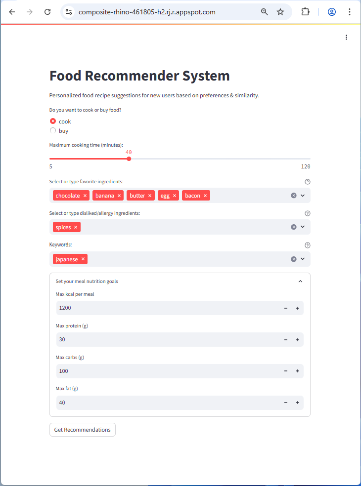
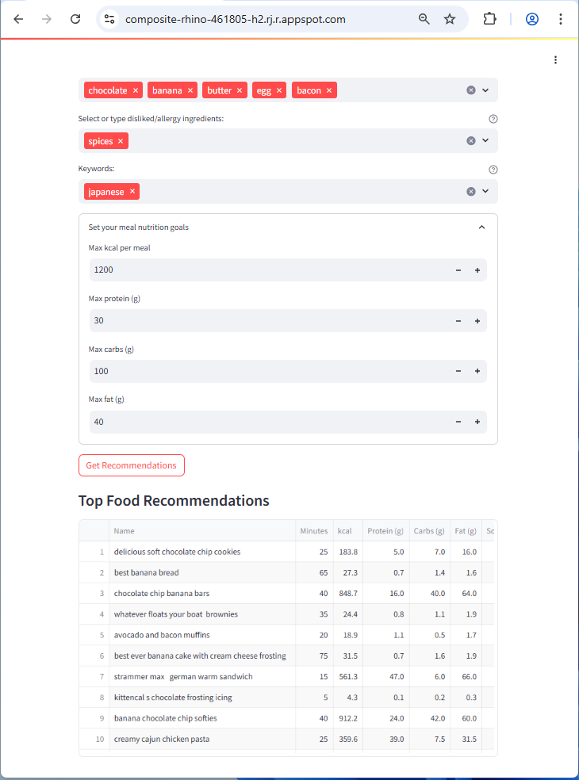

# AIPI 540: Recommender System Module Project: Food Recommender
### **Author**: Matana Pornluanprasert

This project aims to create a hybrid recommender system that can recommend food recipes based on user preference. The data source comes from Food.com dataset on Kaggle, which contains food recipe metadata and user interactions (recipes ratings). Two models, Wide & Deep (WD, deep learning), and Field-aware Factorization Machine (FFM, classical machine learning), are deployed and evaluated. <br>
<br>

***
# The Problem<br>

Choosing food or creating a meal plan that suits to individual needs is now become mainstream, as people nowadays are actively looking for nutrition data, and try to manage them on a daily basis, for NCD prevention, personal hygienes, weight loss, weight training, or special needs (i.e. people with diabetes). However, in order to be sustainable in the meal plan and nutrition control, the choice of food should also align with user's personal preference. This project is built to recommend recipes based on personal needs and preferences, powered by hybrid recommender system. It can generate list of recipes based on user's historical interaction data, and personal needs. The list can be fed as an input to optimization model (i.e. integer linear programming with constraints on personal nutrition goal and food diversity; not included in this project) to create a personalized meal plan.<br>
<br>

***
# Data Source<br>
The training data comes from public data available on Kaggle, originally sourced from Food.com, which can be accessed from the following links:<br>

- Food.com Recipes and Interactions, by Shuyang Li and Bodhisattwa Prasad Majumder<br>
[https://www.kaggle.com/datasets/shuyangli94/food-com-recipes-and-user-interactions](https://www.kaggle.com/datasets/shuyangli94/food-com-recipes-and-user-interactions)<br>
Data used in the model: RAW_interactions.csv, RAW_recipes.csv, PP_recipes.csv<br>

- Food.com Recipes with Search Terms and Tags, by Shuyang Li<br>
[https://www.kaggle.com/datasets/shuyangli94/foodcom-recipes-with-search-terms-and-tags](https://www.kaggle.com/datasets/shuyangli94/foodcom-recipes-with-search-terms-and-tags)<br>
Data used in the model: recipes_w_search_terms.csv<br>

The two datasets are used in the following paper:<br>

- Majumder, B. P., Li, S., Ni, J., & McAuley, J. (2019). *Generating Personalized Recipes from Historical User Preferences*. In Proceedings of the 2019 Conference on Empirical Methods in Natural Language Processing (EMNLP), pp. 5975–5981. Association for Computational Linguistics.<br>
[https://www.aclweb.org/anthology/D19-1613/](https://www.aclweb.org/anthology/D19-1613/)<br>

- Li, S., Li, Y., Ni, J., & McAuley, J. (2021). *SHARE: A System for Hierarchical Assistive Recipe Editing.* arXiv preprint arXiv:2105.08185.<br>
[https://arxiv.org/abs/2105.08185](https://arxiv.org/abs/2105.08185)<br>

Due to limitation in computing resource, only 10% of user interaction data is randomly sampled and used to train the models.<br>

We generate average embeddings of ingredients for each recipe by Food2Vec, which is part of the paper below:<br>
- Pellegrini, C., Özsoy, E., Wintergerst, M., & Groh, G. (2021). *Exploiting Food Embeddings for Ingredient Substitution*. In Proceedings of the 14th International Joint Conference on Biomedical Engineering Systems and Technologies (BIOSTEC 2021), Vol. 5: HEALTHINF, pp. 67–77. SciTePress.<br>
[https://doi.org/10.5220/0010202000670077](https://doi.org/10.5220/0010202000670077)<br>

- The Food2Vec model can be accessed from the following link:<br>
[https://github.com/ChantalMP/Exploiting-Food-Embeddings-for-Ingredient-Substitution](https://github.com/ChantalMP/Exploiting-Food-Embeddings-for-Ingredient-Substitution)<br>
[https://github.com/ChantalMP/Exploiting-Food-Embeddings-for-Ingredient-Substitution/releases/download/0.1/food2vec_models.zip](https://github.com/ChantalMP/Exploiting-Food-Embeddings-for-Ingredient-Substitution/releases/download/0.1/food2vec_models.zip)<br>
In this repos, Food2Vec model can be located in data/outputs/food2vec_model.bin<br>
<br>

***
# Model Evaluation Process & Metric Selection<br>
We choose MAP@10 as our primary evaluation metrics, and also provide Recall@10, NDCG@10, and AUC as alternatives. MAP, NDCG, and Recall at k=5 and 20 are also presented for comparison. MAP@10 is selected for it best reflection of quality in top k recommendations. It penalizes false positives in ranking, rewards hits, and be more interpretable than AUC in recommendation task. For sparse interaction (like user interactions on Food.com), Recall can be inflated with large k. NDCG can be complement to MAP, but it is sensitive to sparsity.<br>
<br>

***
# Modeling Approach<br>

**Data Processing Pipeline**<br>
1. Food.com data can be downloaded directly from Kaggle links above. After download, put RAW_interactions.csv, RAW_recipes.csv, PP_recipes.csv, and recipes_w_search_terms.csv in data/raw/recipe_interaction/ folder. The data is excluded from this repos
2. Randomly sampling only 10% of the data (10% based on total number of unique users), and select interactions with ratings 4-5 as positive interactions
3. Encode user id and recipe id using label encoder
4. Merge multiple tables into recipes and interactions dataframe
5. Parse nutritional vector to separate column, divided by servings to get nutrition per serve
6. Generate average embeddings of ingredients for each recipe by using Food2Vec, with dimension of 100
7. For ingredients that cannot be matched with Food2Vec vectors, treat them as fallback tags (for frequent ingredients)
8. Combine tags, search terms, fallback tags into set of final tags, then generate average embeddings of these tags for each recipe with Word2Vec, with dimension of 50
9. Treat (cooking) techniques data as binary vector, with dimension of 58. Use concatenated vector of nutritional data, ingredient embeddings, and (cooking) techniques to train KMeans Clustering to determine hidden clusters in the recipe metadata, and combine smaller clusters into a single cluster
10. Apply standard scaler on nutrition data and minutes (cooking time)
11. Stratified split data based on users, ensuring that for each user, their interactions are in all three sets. However, users that have less than 3 interactions will have their interactions put in training set only. For each user, allocate 15% of their interactions to validation set, and another 15% to test set. With multiple users having less than 3 interactions, all their interactions will be 100% allocated to training set. With this approach, the final number of positive samples is approximately 80% for training set, and 10% each for validation and test sets.
12. Generate negative samples for train, validation, test set at 5, 10, 20 samples per positive interaction, respectively
13. Merge interactions dataframe with relevant recipes metadata
14. Expand vector data into separate columns, and write FFM files according to FFM specification, which can be fed into training of FFM model
15. With the same set of data in 14. (before conversion to FFM files), transform them using Wide & Deep tab and wide preprocessors. The transformed data can be fed into training of Wide & Deep model.<br>

All files in processed and outputs folder can be generated by running setup.py or training_evaluation.ipynb. All of them are generated as backup during training. Files larger than 100 MB are excluded from the repos.
<br>

**Model evaluated and model selected**<br>
Evaluation is made by calculating and comparing MAP@10 of the two models<br>
1. Deep learning model: Wide and Deep (WD)
2. Classical machine learning model: Field-aware Factorization Machine (FFM)<br>

Wide & Deep has wide part capturing co-occurence patterns and explicit cross-features, which is good for memorizing frequent patterns (e.g. a user who likes high protein meals). It also has deep part that can capture nonlinear interactions. It can accept categorical features via embeddings (ingredients, tags, search terms), continuous features (nutrition per serve, cooking time), and binary vectors (cooking techniques). It supports GPU computation for scalability. However, in this project we utilize CPU to train the model.<br>

FFM handles sparse one-hot/tabular features (ingredients, tags, search terms) extremely well. It can be trained on smaller dataset or highly sparse data, and capture pairwise feature interactions across different fields. The main drawback of FFM is that it cannot capture nonlinear patterns and only support training on CPU.<br>


**Comparison to naive approach**<br>
We create a naive approach for food recommender, by recommending only top 10 global popular recipes (ranking based on interaction counts). Scores are normalized to [0, 1] by maximum number of counts among the top 10. <br>
<br>

***
# Demo of project's visual interface<br>
Demo application is deployed on Google Cloud, and can be accessed via the link below:<br>
[https://composite-rhino-461805-h2.rj.r.appspot.com/](https://composite-rhino-461805-h2.rj.r.appspot.com/)<br>

Give your input/requirements on food recipes: cook or buy, cooking time, favorite ingredients, disliked ingredients, keywords, nutrition goals. Unhide nutrition section and set nutrition goals:<br>


The app returns a recommended list of food recipes, from a combination of rule based scoring and WD model. The rule based runs first by using inputs from user, creating a vector that represent preference of the user, comparing with vectors of existing users using cosine similarity, getting the most similar user, and using user id of this existing user to get recommendations from WD Model. The app then merges the two lists of recommended food recipes and return:<br>
 
<br>

***
# Results and Conclusions<br>

WD performs better than FFM across all metrics except Recall@20. It is especially strong in MAP and NDCG, indicating better ranking of relevant items. This may result from WD's ability to learn better non-linear interactions than FFM.<br>

In comparison to FFM and WD, all metrics of naive approach are deceptively higher due to the fact that most interactions are concentrated on top global recipes (popularity bias). However, our target users are those who want personalized recommendations, so they will not pick from the list of top recipes if it does not align with their nutrition goal and personal preferences. Naive prediction can serve the majority of regular users well, but not suitable for our target users.<br>

**Model Performance Comparison**:<br>

| Model     | MAP@10 | NDCG@10 | Recall@10 | AUC    | MAP@5  | NDCG@5 | Recall@5 | MAP@20 | NDCG@20 | Recall@20 |
|-----------|--------|---------|------------|--------|--------|--------|-----------|--------|----------|-------------|
| **FFM**   | 0.1248 | 0.2062  | 0.4046     | 0.5316 | 0.1007 | 0.1444 | 0.2244    | 0.1442 | 0.2720  | 0.6291      |
| **WD**    | 0.2543 | 0.3349  | 0.4269     | 0.5345 | 0.2500 | 0.3077 | 0.3192    | 0.2662 | 0.3850  | 0.6211      |
| **Naive** | 0.5715 | 0.6339  | 0.5686     | 0.5053 | 0.5881 | 0.6525 | 0.5686    | 0.5674 | 0.6280  | 0.5686      |


The Food.com dataset is a widely used resource in food recommender system research due to its large size, rich recipe metadata, and user interaction data. However, while the Food.com dataset provides a common benchmark, many existing works differ significantly in their modeling approaches, evaluation metrics, and preprocessing techniques. For example, some focus on image-text embeddings, others on sequential user behavior modeling, or health-aware dietary constraints. These differences mean their results are often not directly comparable to this project trained solely on tabular interaction data.<br>

This project use Food2Vec model for generation of mean ingredient embeddings, use Word2Vec to generate average tags embeddings, use cooking techniques vector, nutrition data, cooking time, and cluster id (KMeans Clustering) to train the models, a combination that may be different from other projects.<br>
<br>

***
# Ethics statement<br>
This project is intended for research and educational purposes in recommender system and deep learning. All data collection, model training, and deployment are conducted with respect for privacy and copyright. Care has been taken to avoid misuse of the model and to ensure responsible use of the technology, particularly in relation to surveilance, personal data, and public safety.<br>
<br>

***
# Requirements and How to run the code

### **Requirements**:<br>
```
scikit-learn==1.7.0
gensim==4.3.3
torch==2.6.0
xlearn==0.40a1
cmake-4.0.3
recommenders==1.2.1
pytorch_widedeep==1.6.5
joblib==1.5.1
tqdm_joblib==0.0.4
tqdm==4.67.1
numpy==1.26.4
pandas==2.3.0
```

For Windows users, xlearn has to be installed from source: <br>
(xlearn-0.4.4-py2.py3-none-win_amd64.whl)<br>
[https://github.com/aksnzhy/xlearn/releases](https://github.com/aksnzhy/xlearn/releases)<br>


### **How to run the code**:<br>
***
Inference Mode: To run the inference mode with Streamlit visual interface code, type the followings in the terminal<br>

```
streamlit run main.py
```

Then go to http://localhost:8080 with your browser. As a new user, give your input (cook or buy, cooking time, favorite ingredients, disliked ingredients, keywords, nutrition goals), and then the code will return a list of recommended food recipes in a tabular format. 

Training Mode: type the followings in the terminal<br>

On Windows:<br>

```
py setup.py
```

On other systems:<br>

```
python setup.py
```

<br>
<br>


